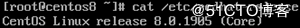
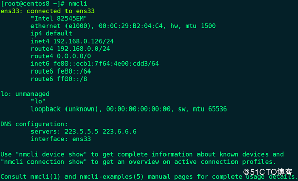
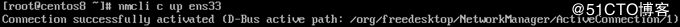
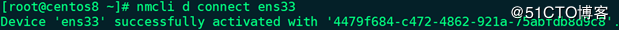
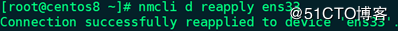
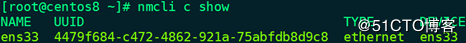
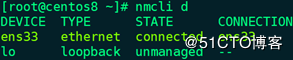
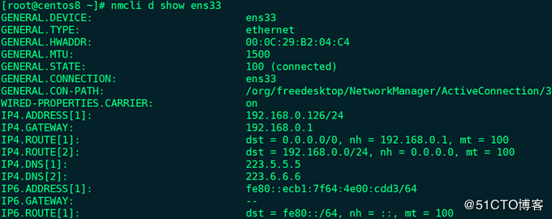
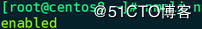
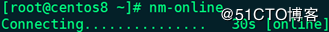

# CentOS8.0 网络配置的实现

## 更改主机名

命令语法为：

```
sudo hostnamectl set-hostname <newhostname>
12
```

这条命令会删除/etc/hostname文件中的主机名，然后替换为新的主 机名。 

 更新时间：2019年10月29日 10:05:40  作者：Marion0728  

这篇文章主要介绍了CentOS8.0 网络配置的实现，文中通过示例代码介绍的非常详细，对大家的学习或者工作具有一定的参考学习价值。

**一、CentOS 7和CentOS 8网络配置区别：**

VMware Workstation 15 Pro中安装了CentOS 8.0.1905，但在配置IP地址过程中发现没有了network.service，并且/etc/sysconfig/network-scripts目录中也没有任何脚本文件，CentOS 7中同时支持network.service和NetworkManager.service（简称NM）2种方式配置网络，而在CentOS 8中已经废弃network.service，必须通过NetworkManager.service配置网络。




**二、NetworkManager的命令行工具nmcli简单使用说明：**

1、查看IP（类似于ifconfig、ip a）：# nmcli



2、激活网卡的3种方式（相当于ifup）：

（1）# nmcli c up ens33



备注：nmcli c | connection，连接，可理解为配置文件，相当于ifcfg-ethX或ifcfg-ensX

（2）# nmcli d connect ens33



备注：nmcli d | device，设备，可理解为实际存在的网卡（包括物理网卡和虚拟网卡）

（3）# nmcli d reapply ens33



3、禁用网卡（相当于ifdown）：# nmcli c down ens33

4、查看connection列表：# nmcli c show



5、查看connection详细信息：# nmcli c show ens33

6、重载所有ifcfg或route到connection（不会立即生效）：# nmcli c reload

7、查看device列表：# nmcli d



备注：device有4种状态

（1）connected：已被NM管理，并且当前有活跃的connection

（2）disconnected：已被NM管理，但是当前没

有活跃的connection

（3）unmanaged：未被NM管理

（4）unavailable：不可用，NM无法管理，通常出现于网卡link为down时（如：ip link set ethX down）

8、查看所有device详细信息：# nmcli d show

9、查看指定device详细信息：# nmcli d show ens33



10、查看NM管理状态：# nmcli n



11、开启NM管理：# nmcli n on

12、检测NM是否在线可用：# nm-online



**说明：有关****nmcli****命令的详细使用说明可以参考****# man nmcli****或****# nmcli -h****，具体对象的用法如****device****，可参考****# man nmcli d****或****# nmcli d -h**