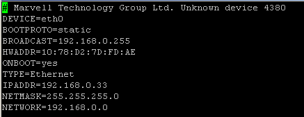
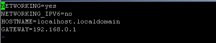

**CentOS设置静态IP的方法总结**

**1、修改网卡配置**

```
`vi /etc/sysconfig/network-scripts/ifcfg-eth0`
```



```
`DEVICE=eth0     #描述网卡对应的设备别名，例如ifcfg-eth0的文件中它为eth0``BOOTPROTO=static    #设置网卡获得ip地址的方式，可能的选项为static，dhcp或bootp，分别对应静态指定的 ip地址，通过dhcp协议获得的ip地址，通过bootp协议获得的ip地址``BROADCAST=192.168.0.255  #对应的子网广播地址``HWADDR=00:07:E9:05:E8:B4  #对应的网卡物理地址``IPADDR=12.168.0.33   #如果设置网卡获得 ip地址的方式为静态指定，此字段就指定了网卡对应的ip地址``NETMASK=255.255.255.0  #网卡对应的网络掩码``NETWORK=192.168.0.0   #网卡对应的网络地址`
```

**2、修改网关配置**

```
`vi` `/etc/sysconfig/network`
```



```
`NETWORKING=yes   #(表示系统是否使用网络，一般设置为yes。如果设为no，则不能使用网络，而且很多系统服务程序将无法启动)``HOSTNAME=centos  #(设置本机的主机名，这里设置的主机名要和/etc/hosts中设置的主机名对应)``GATEWAY=192.168.0.1 #(设置本机连接的网关的IP地址。)`
```

一般情况下是添加最后一行。

**3、修改DNS配置**

```
`vi` `/etc/resolv``.conf`
```


nameserver　#即是DNS服务器ＩＰ地址，第一个是首选，第二个是备用。

**4、重启网络**

```
`service network restart`
```

或者

```
`/etc/init.d/network restart`
```

感谢阅读，希望能帮助到大家，谢谢大家对本站的支持！

#### 修改主机名

