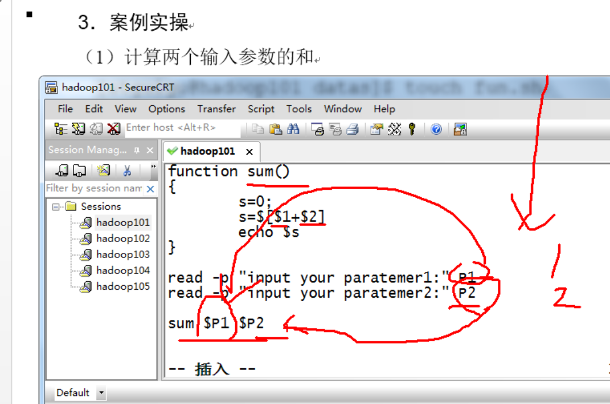

# Shell相关问题

###### A=hello world:报错

A="hello world"

---

可把变量提升为全局环境变量，可供其他Shell程序使用

export 变量名

[atguigu@hadoop101 datas]$ vim helloworld.sh 

 

在helloworld.sh文件中增加echo $B

\#!/bin/bash

 

echo "helloworld"

echo $B

 

[atguigu@hadoop101 datas]$ ./helloworld.sh 

Helloworld

发现并没有打印输出变量B的值。

[atguigu@hadoop101 datas]$ export B

[atguigu@hadoop101 datas]$ ./helloworld.sh 

helloworld

2

---

$*和$@都表示传递给函数或脚本的所有参数，不被双引号“”包含时，都以$1 $2 …$n的形式输出所有参数。

（b）当它们被双引号“”包含时，“$*”会将所有的参数作为一个整体，以“$1 $2 …$n”的形式输出所有参数；“$@”会将各个参数分开，以“$1” “$2”…”$n”的形式输出所有参数。

[atguigu@hadoop101 datas]$ vim for.sh

 

\#!/bin/bash 

 

for i in "$*" 

\#$*中的所有参数看成是一个整体，所以这个for循环只会循环一次 

​    do 

​        echo "ban zhang love $i"

​    done 

 

for j in "$@" 

\#$@中的每个参数都看成是独立的，所以“$@”中有几个参数，就会循环几次 

​    do 

​        echo "ban zhang love $j" 

done

 

[atguigu@hadoop101 datas]$ chmod 777 for.sh

[atguigu@hadoop101 datas]$ bash for.sh cls xz bd

ban zhang love cls xz bd

ban zhang love cls

ban zhang love xz

ban zhang love bd

---

