# 组管理与权限管理

## 用户相关操作

### logout：注销登录

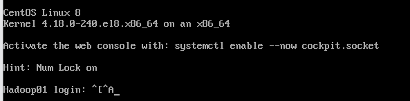

### useradd [选项] 用户名：添加用户

1.没有指定组 则创建同名组，并放入此组

2.useradd -d 指定目录 新的用户名，给新创建的用户指定家目录

​	不能将目录设置为其他人的家目录

3.useradd -g 用户组 用户名

### passwd 用户名 ：指定密码

### userdel 用户名：删除用户名

不加r不删除家目录

userdel -r 用户名：删除用户名并删除此用户的家目录

### id 用户名：查看用户名详细信息

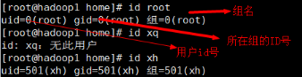

### su - 用户名：切换用户

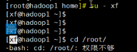

### exit，logout：返回原来用户

### groupadd 组名：创建组

### groupdel 组名：删除组 

### useradd -g 用户组 用户名：创建用户时指定组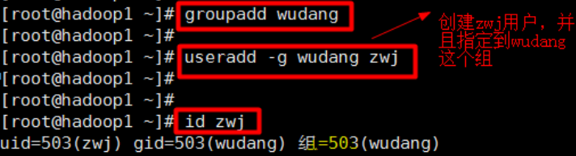

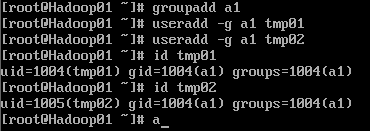

### usermod -g 用户组 用户名：修改组

### 用户配置文件（用户信息）：/etc/passwd

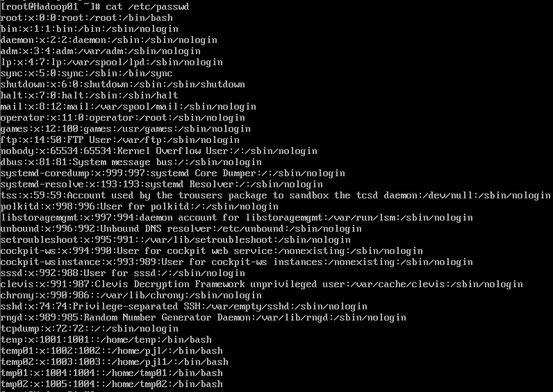

### 组配置文件：/etc/group

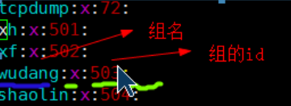

### 密码配置文件：/etc/shadow(密码和登陆信息，是加密的)

## 组管理与权限管理

### chown 用户名 文件名：修改文件所有者

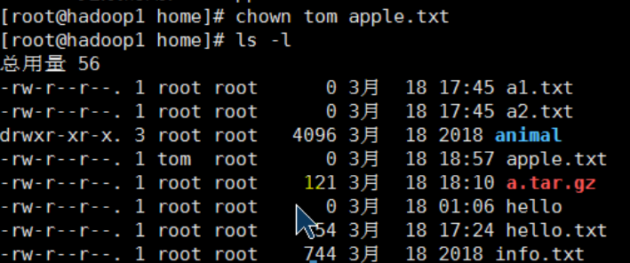

此时文件所在组不是文件拥有者的所在组

chown 用户名:用户组 文件名：修改文件所有者和所有组

## chgrp 组名 文件名：修改文件所在组

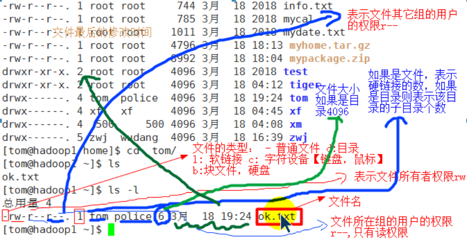

w代表可写：可以修改，但是不代表可以删除该文件，删除一个文件的前提条件是对该文件所在目录有写权限，才能删除该文件。

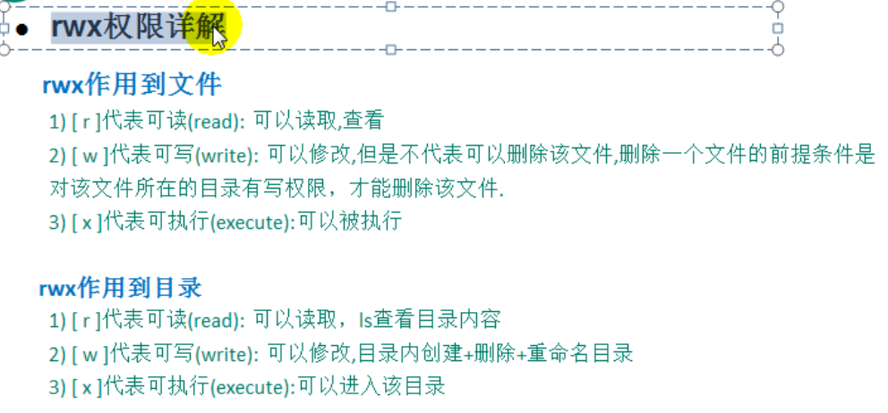

### chmod 改变权限

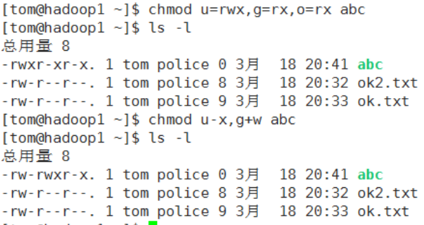

a 所有人，包含ugo

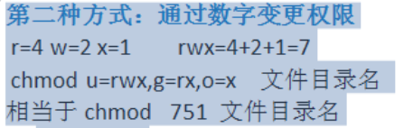

