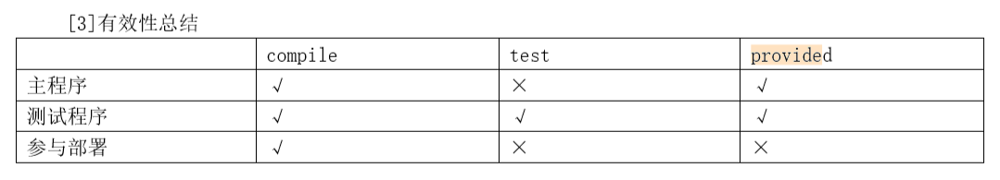

###  依赖的传递性

当存在间接依赖的情况时，主工程对间接依赖的jar可以访问吗？这要看间接依赖的jar包引入时的依赖范围——只有依赖范围为compile时可以访问。例如：

| Maven工程 | 依赖范围 | 对A的可见性 |         |      |
| --------- | -------- | ----------- | ------- | ---- |
| A         | B        | C           | compile | √    |
| D         | test     | ×           |         |      |
| E         | provided | ×           |         |      |

###  依赖的原则：解决jar包冲突 

1）路径最短者优先

2）路径相同时先声明者优先

这里“声明”的先后顺序指的是dependency标签配置的先后顺序。