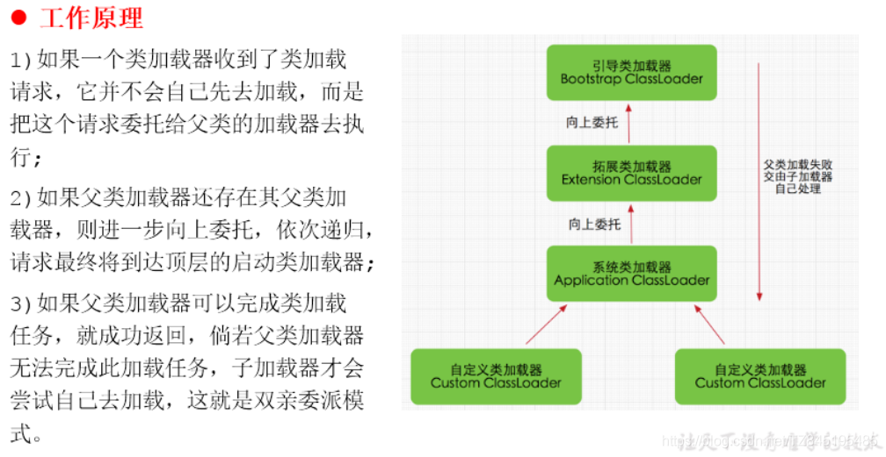
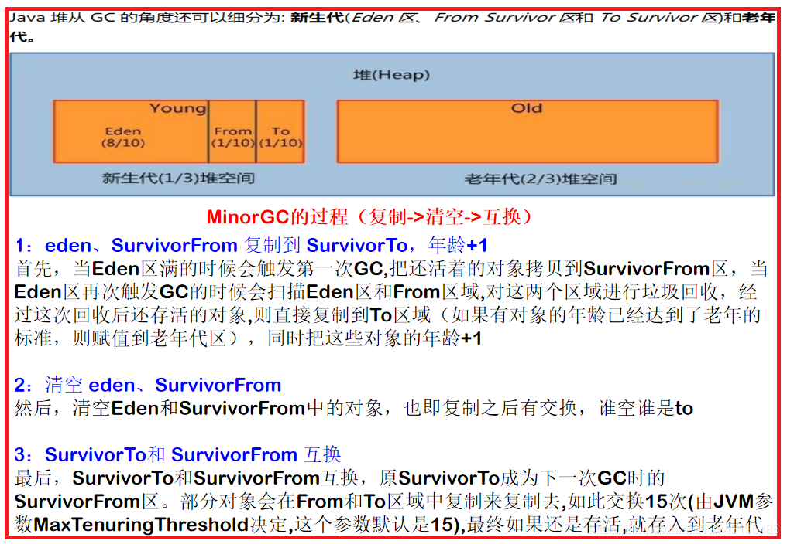

# ①. Jvm总体架构

**`1>.` jvm总体架构**

1.什么是JVM？

- ①. JVM 是 java虚拟机，是用来执行java字节码(二进制的形式)的虚拟计算机
- ②. jvm是运行在操作系统之上的，与硬件没有任何关系

2.Java的跨平台及原理

- ①. 跨平台：由Java编写的程序可以在不同的操作系统上运行：一次编写，多处运行
- ②. 原理：编译之后的字节码文件和平台无关，需要在不同的操作系统上安装一个对应版本的虚拟机(JVM)

3.JVM的分类

- ①. 类加载子系统
- ②. 运行时数据区 [ 我们核心关注这里 的栈、堆、方法区 ]
- ③. 执行引擎(一般都是JIT编译器和解释器共存)
    JIT编译器(主要影响性能)：编译执行； 一般热点数据会进行二次编译，将字节码指令变成机器指令。将机器指令放在方法区缓存
    解释器(负责相应时间)：逐行解释字节码


**`4.` 三大商业虚拟机`（掌握）`**

- ①. Sun HotSpot

> 解释：
> 1.提起HotSpot VM，相信所有Java程序员都知道，它是Sun JDK和OpenJDK中所带的虚拟机，也是目前使用范围最广的Java虚拟机
> 2.在2006年的JavaOne大会上，Sun公司宣布最终会把Java开源，并在随后的一年，陆续将JDK的各个部分（其中当然也包括了HotSpot VM）在GPL协议下公开了源码， 并在此基础上建立了OpenJDK。这样，HotSpot VM便成为了Sun JDK和OpenJDK两个实现极度接近的JDK项目的共同虚拟机。
> 3.在2008年和2009年，Oracle公司分别收购了BEA公司和Sun公司，这样Oracle就同时拥有了两款优秀的Java虚拟机：JRockit VM和HotSpot VM。 Oracle公司宣布在不久的将来（大约应在发布JDK 8的时候）会完成这两款虚拟机的整合工作，使之优势互补。 整合的方式大致上是在HotSpot的基础上，移植JRockit的优秀特性，譬如使用JRockit的垃圾回收器与MissionControl服务， 使用HotSpot的JIT编译器与混合的运行时系统

- ②. BEA JRocket

> 解释：
> 1.专注于服务端应用(JRockit内部不包含解析器实现，全部代码都靠即时编译器编译后执行)
> 2.Jrockit JVM 是世界上最快的jvm
> 3.2008年被oracle收购

- ③. iBM J9

> 解释：
> 1.市场定位与hotspot接近，服务器端，桌面应用，嵌入式等
> 2.目前，是影响力的三大商业虚拟机之一

# ②. (1).类的加载

**`1>.` 类的加载`掌握`**


## ①. 简述类的加载过程

**`1.` 简述类的加载过程**

- 当程序要使用某个类时，如果该类还未被加载到内存中，则**系统会通过`类的加载、类的链接、类的初始化`这三个步骤来对类进行初始化。** 如果不出现意外，JVM将会连续完成这三个步骤，所以有时也把这三个步骤统称为类加载或者初始化
    

## ②. 什么是类的加载(Loading)

2.什么是类的加载(Loading)

- 类的加载指的是将类的.class文件中的二进制数据读取到内存中，存放在运行时数据区的方法区中，并创建一个大的Java.lang.Class对象，用来封装方法区内的数据结构

## ③. 链接(Linking)

**`3.` 链接(Linking)**

- ①. 验证：确保Class文件的字节流中包含信息符合当前虚拟机要求，保证被加载类的正确性
- ②. 准备：
    (1).为类变量分配内存并且设置该类变量的默认初始化值
    (2).不会为实例变量分配初始化
- ③. 解析：
    将常量池中的符号引号转换为直接引用的过程

> 解释什么是符号引号和直接引用
> 教室里有个空的位子没坐人，座位上边牌子写着小明的座位（符号引用），后来小明进来坐下去掉牌子（符号引用换成直接引用）


## ④. 初始化(Initialization)

**`4.` 初始化(Initialization)**

- ①. 为类变量赋予正确的初始化值
- ②. 初始化阶段就是执行类构造器方法< clinit >()的过程
- ③. 类的初始化阶段就是执行类的构造方法(clinit)的过程
    (构造器方法中指令按语句在源文件中出现的顺序执行)
- ④. < clinit > 不同于类的构造器，有静态变量或static{ } 代码块 那么字节码文件就有这个方法
- ⑤. 若该类具有父类，Jvm会保证子类的< clinit >() 执行前，父类的< clinit >() 已经执行完成


# ②. (2) 类加载器的介绍

**`2>.` 类加载器的介绍**

- ①. JVM支持两种类型的类加载器,分别为引导类加载器(Bootstrap ClassLoader)和自定义类加载器(User-Defined ClassLoader)
- ②. 从概念上来讲,自定义类加载器一般指的是程序中由开发人员自定义的一类类加载器，但是Java虚拟机规范并没有这么定义,而是将所有派生于抽象类ClassLoader的类加载器都划分为自定义类加载器
- ③. sum.misc.Launcher:它是一个java虚拟机的入口应用
- ④. 无论类加载器的类型如何划分,在程序中我们常见的类加载器始终只有3个,如下所示:


## ①. 启动类加载器

1.启动类加载器(引导类加载器 Bootstrap ClassLoader)

- ①. 这个类加载使用C/C++语言实现的，嵌套在JVM内部
- ②. 它用来加载Java的核心类库(JAVA_HOME/jre/lib/rt.jar、resource.jar或sum.boot.class.path路径下的内容)，用于提供JVM自身需要的类
- ③. 并不继承自java.lang.ClassLoader，没有父加载器
- ④. 加载扩展类和应用程序类加载器，并指定为他们的父类加载器
- ⑤. 由于安全考虑，Bootstrap启动类加载器只加载包名为java、javax、sun等开头的类

## ②. 扩展类加载器(Extension ClassLoader)

2.扩展类加载器

- ①. Java语言编写，由sum.music.Launcher$ExtClassLoader实现
- ②. 派生于ClassLoader类
- ③.父类加载器为启动类加载器
- ④.从java.ext.dirs系统属性所指定的目录中加载类库，或从JDK的安装目录的jre/lib/ext子目录(扩展目录)下加载类库。如果用户创建的JAR放在此目录下，也贵自动由扩展类加载器加载

## ③. 应用程序类加载器(系统类加载器)

3.应用程序类加载器(系统类加载器 AppClassLoader)

- ①. java语言编写，由sum.misc.Launcher$AppClassLoader实现
- ②. 派生于ClassLoader类
- ③. 父类加载器为扩展类加载器
- ④. 它负责加载环境变量classpath或系统属性java.class.path指定路径下的类库
- ⑤.**`该类加载是程序中默认的类加载器`**，一般来说，Java应用的类都是由它来完成加载
- ⑥. 通过ClassLoader#getSystemClassLoader()方法可以获取到该类加载器

## ④. 用户自定义类加载器(了解)

4.用户自定义类加载器

- 在Java的日常应用程序开发中，类的加载几乎是由上述3种类加载器相互配合执行的，在必要时，我们换可以自定义类加载器，来定制类的加载方式
- 如果获取ClassLoader


## ⑤. 双亲委派机制 `掌握`

**`5.` 双亲委派机制(`掌握)`**

- ①. 工作原理



- ②. 优势：
    

## ⑥. 沙箱安全机制

**`6.` 沙箱安全机制(`掌握`)**


## ⑦. 如何判断两个Class对象是否相同

7.如何判断两个Class对象是否相同

- ①. 相同必须的两个条件如下：


- ②. JVM必须知道一个类型是由启动加载器加载还是用户类加载器加载的。如果一个类型是又用户类加载器加载的，**`那么JVM会将这个类加载器的一个引用作为类型信息的一部分保存在方法区中。`**

## ⑧. 主动使用和被动使用

8.主动使用和被动使用


# ③. Execution Engine

**`3>.` Execution Engine**

- 负责执行java文件的

# ④. 运行时数据区(Rutime data Area)

## ①. 程序计数器

**`1>.`程序计数器**

- **①. 作用，是用来存储指向下一条指令的地址，也即将要执行的指令代码。由执行引擎读取下一条指令**
- **②. 特点：(1).是线程私有的 (2).不会存在内存溢出**
- ③. 注意：在物理上实现程序计数器是在寄存器实现的，整个cpu中最快的一个执行单元
- ④. 它是唯一一个在java虚拟机规范中没有OOM的区域

> 解释：
> 
> 

- ⑤. 使用PC寄存器存储字节码指令地址有什么用呢?
    为什么使用PC寄存器记录当前线程的执行地址呢?


- ⑥. PC寄存器为什么设定为线程私有?
    为了能够准确记录各个线程正在执行的当前字节码指令地址，最好的办法自然是为每一个线程都分配一个PC寄存器
- ⑦. 关于线程在JVM中的说明：

```handlebars
	1.在Hotspot JVM里,每个线程都与操作系统的本地线程直接映射
	解释:当一个Java线程准备好执行以后,此时一个操作系统的本地线程也同时创建.Java线程执行终
止后,本地线程也会被回收
	2.操作系统负责所有线程的安排调度到任何一个可用的CPU上。一旦本地线程初始化完毕,它就会调
用Java线程中的run方法
12345
```

## ②. 本地方法栈

**`2>.` 本地方法栈**

- ①. Native Interface本地接口
    
- ②. 本地方法栈(Native Method Stack)
    (它的具体做法是Native Method Stack中登记native方法，在Execution Engine 执行时加载本地方法库)
- ③. native方法的举例: Object类中的clone wait notify hashCode 等 Unsafe类都是native方法


## ③. 虚拟机栈(重点)

**`3>.` 虚拟机栈`(掌握)`**

### ①. 什么是 Java virtual machine?

1.什么是Java virtual machine(虚拟机)？
(栈并不是越大越好，越多可以防止出现StackOverflowError晚点出现，但是栈越大，也就代表着虚拟机栈是一定的，你的栈越大，别的栈就会小)

- **①. 栈的概述
    每创建一个线程就会创建一个Java栈，每一个Java栈中都会有很多栈帧(局部变量表 | 操作数栈 | 动态链接 | 方法返回地址 | 一些附加信息) `掌握`**

> 解释：
> 1.虚拟机栈（Java Virtual Machine Stacks）和线程是紧密联系的，每创建一个线程时就会对应创建一个Java栈，所以Java栈也是"线程私有"的内存区域，这个栈中又会对应包含多个栈帧，每调用一个方法时就会往栈中创建并压入一个栈帧，栈帧是用来存储方法数据和部分过程结果的数据结构，每一个方法从调用到最终返回结果的过程，就对应一个栈帧从入栈到出栈的过程 **`[先进后出]`**
> 2.栈帧中有如下部分组成：
> 3.栈的其他介绍
> 

- **②. 存放于栈中的东西如下 `[掌握]`**
    **`(8种基本类型的变量+对象的引用变量+实例方法都是在函数的栈内存中分配[局部变量])`**
- **③. 栈内存溢出(StackOverflowError) `-Xss`参数
    (1). 栈帧过多导致栈内存溢出(方法的递归调用,没设置正确停止条件)
    (2). 栈帧过大(栈帧大小>栈内存)**

```java
	    Exception in thread "main" java.lang.StackOverflowError
		//sayHello（）发生了递归
		public class DemoT {
		    public static void main(String[] args) {
		        sayHello();
		    }
		    
		    public static void sayHello(){
		        sayHello();
		    }
		}
1234567891011
```


### ②. 局部变量表(LocalVariables)

**`2.` 局部变量表(LocalVariables) `掌握`**

- **①. `定义为一个数字数组，主要用于存储方法参数和定义在方法体内的局部变量`**(这些数据类型包括各种基本数据类型、对象引用(reference)以及return Address类型)
- ②. 由于局部变量是建立在线程的栈上，是线程私有数据，因此不存在数据安全问题
- **③. `局部变量表所需容量大小是在编译期确定下来的`。**(并保存在方法Code属性的maximum local variables数据项中，在方法运行期间不会改变局部变量表的大小的)

```java
//使用javap -v 类.class 或者使用jclasslib
public class LocalVariableTest {
    public static void main(String[] args) {
        LocalVariableTest test=new LocalVariableTest();
        int num=10;
        test.test1();
    }
    public static void test1(){
        Date date=new Date();
        String name="xiaozhi";
    }
}
123456789101112
```

> jclasslib说明：
> 

- **④. `关于slot的理解(引用数据类型(方法的返回地址)占用1个slot)`**
    (1).局部变量表，是基本的存储单元是slot(变量槽)
    (2).在局部变量表中，32位以内的类型只占有一个slot(包括引用数据类型)，64位的类型(long和double)占有两个slot
    byte、short、char在存储前被转换为int,boolean也被转换为int(0表示fasle，非0表示true)
    long和double则占据两个slot
- ⑤. Jvm会为局部变量表中的每一个slot都分配一个访问索引，通过这个索引即可成功访问到局部变量表中指定的局部变量值
- ⑥. 如果需要访问局部变量表中一个64bit的局部变量值时，只需要使用前一个索引即可(比如:访问long或double类型变量)
    
- **⑦. `如果当前帧是由构造方法或者实例方法创建，那么该对象引用this将会放在index为0的slot处`**
    


### ③. 操作数栈(operand stack)

**`3.` 操作数栈(operand stack) `掌握`**

- ①. 每一个独立的栈帧中除了包含局部变量表以外，还包含了一个后进先出的操作数栈，也可以称之为表达式栈
- ②. 操作数栈，在方法执行过程中，根据字节码指令，往栈中写入数据或提取数据，即入栈或出栈
- **③. `如果被调用的方法带有返回值的话，其返回值将会被压入当前栈帧的操作数栈中`**
- **④. `操作数栈，主要用于保存计算机过程的中间结果，同时作为计算过程中变量临时的存储空间`**
- ⑤. 操作数栈的具体说明：

> 解释：
> 


### ④. 动态链接（Dynamic Linking）

**`4.` 动态链接（Dynamic Linking）**


- ①. 运行时常量池位于方法区，字节码中的常量池结构如下：
    
- ②.为什么需要常量池呢？
    (常量池的作用，就是为了提供一些符号和常量，便于指令的识别。下面提供一张测试类的运行时字节码文件格式)
    
- ③. 每一个栈帧内部都包含一个指向运行时常量池Constant pool或该栈帧所属方法的引用。包含这个引用的目的就是为了支持当前方法的代码能够实现动态链接。比如invokedynamic指令
- ④. 在Java源文件被编译成字节码文件中时，所有的变量和方法引用都作为符号引用（symbolic Refenrence）保存在class字节码文件（javap反编译查看）的常量池里。比如：描述一个方法调用了另外的其他方法时，就是通过常量池中指向方法的符号引用来表示的，那么 **`动态链接的作用就是为了将这些符号引用（#）最终转换为调用方法的直接引用`。**

### ⑤. 方法的调用：(小插曲)难点

5.方法的调用：(小插曲)难点

- ①. 静态链接(早期绑定)：当一个 字节码文件被装载进JVM内部时，如果被调用的目标方法在编译期可知，且运行期保持不变时。这种情况下将调用方法的符号引用转换为直接引用的过程称之为静态链接
    (invokestatic | invokespecial)
- ②. 动态链接(晚期绑定)：如果被调用的方法在编译期无法被确定下来，也就是说，只能够在程序运行期将调用方法的符号引用转换为直接引用，由于这种引用转换过程具备动态性，因此也就被称之为动态链接。**`体现了多态`**
    (invokevirtual | invokeinterface)
- ③. **`非虚方法：`** 如果方法在编译器就确定了具体的调用版本，这个版本在运行时是不可变的。这样的方法称为非虚方法
    **`(静态方法、私有方法、final方法、实例构造器（实例已经确定，this()表示本类的构造器）、父类方法（super调用）都是非虚方法)`**
- ④. 其他所有体现多态特性的方法称为虚方法
- ⑤. 如下指令要重点掌握

```handlebars
	普通调用指令：
	1.invokestatic：调用静态方法，解析阶段确定唯一方法版本；
	2.invokespecial:调用<init>方法、私有及父类方法，解析阶段确定唯一方法版本；
	3.invokevirtual:调用所有虚方法；
	4.invokeinterface：调用接口方法；
	动态调用指令（Java7新增）：
	5.invokedynamic：动态解析出需要调用的方法，然后执行 .
	前四条指令固化在虚拟机内部，方法的调用执行不可人为干预，而invokedynamic指令则支持由
用户确定方法版本。
    其中invokestatic指令和invokespecial指令调用的方法称为非虚方法

    其中invokevirtual（final修饰的除外，JVM会把final方法调用也归为invokevirtual指
令，但要注意final方法调用不是虚方法）、invokeinterface指令调用的方法称称为虚方法。
12345678910111213
/**
 * 解析调用中非虚方法、虚方法的测试
 */
class Father {
    public Father(){
        System.out.println("Father默认构造器");
    }

    public static void showStatic(String s){
        System.out.println("Father show static"+s);
    }

    public final void showFinal(){
        System.out.println("Father show final");
    }

    public void showCommon(){
        System.out.println("Father show common");
    }

}

public class Son extends Father{
    public Son(){
        super();
    }

    public Son(int age){
        this();
    }

    public static void main(String[] args) {
        Son son = new Son();
        son.show();
    }

    //不是重写的父类方法，因为静态方法不能被重写
    public static void showStatic(String s){
        System.out.println("Son show static"+s);
    }

    private void showPrivate(String s){
        System.out.println("Son show private"+s);
    }

    public void show(){
        //invokestatic
        showStatic(" 大头儿子");
        //invokestatic
        super.showStatic(" 大头儿子");
        //invokespecial
        showPrivate(" hello!");
        //invokespecial
        super.showCommon();
        //invokevirtual 因为此方法声明有final 不能被子类重写，所以也认为该方法是非虚方法
        showFinal();
        //虚方法如下
        //invokevirtual
        showCommon();//没有显式加super，被认为是虚方法，因为子类可能重写showCommon
        info();

        MethodInterface in = null;
        //invokeinterface  不确定接口实现类是哪一个 需要重写
        in.methodA();

    }

    public void info(){

    }

}

interface MethodInterface {
    void methodA();
}
12345678910111213141516171819202122232425262728293031323334353637383940414243444546474849505152535455565758596061626364656667686970717273747576
```

### ⑥. 关于invokedynamic指令

6.关于invokedynamic指令

- JVM字节码指令集一直比较稳定，一直到java7才增加了一个invokedynamic指令，这是Java为了实现【动态类型语言】支持而做的一种改进
- 动态类型语言和静态类型语言两者的却别就在于对类型的检查是在编译期还是在运行期，满足前者就是静态类型语言，反之则是动态类型语言。
- Java是静态类型语言（尽管lambda表达式为其增加了动态特性），js，python是动态类型语言

```java
Java:String info = "小智";//静态语言

JS:var name = "小智“；var name = 10;//动态语言

Pythom: info = 130;//更加彻底的动态语言
12345
```

### ⑦. 方法返回地址（Return Address）

7.方法返回地址（Return Address）
**`(pc寄存器每执行一条指令都会被改变`
`而返回地址在调用call之前一直是上一条call后面的地址，不改变)`**

- ①. 存放调用该方法的PC寄存器的值
- ②. 执行引擎遇到任意一个方法返回的字节码指令（return），会有返回值传递给上层的方法调用者，简称正常完成出口；

```handlebars
    1.一个方法在正常调用完成之后究竟需要使用哪一个返回指令还需要根据方法返回值的实际
数据类型而定
    2.在字节码指令中，返回指令包含ireturn（当返回值是boolena、byte、char、short和int
类型时使用）、lreturn、freturn、dreturn以及areturn(引用类型的)
    3.另外还有一个return指令供声明为void的方法、实例初始化方法、类和接口的初始化方法使用
12345
```


- ③. 在方法执行的过程中遇到了异常（Exception），并且这个异常没有在方法内进行处理，也就是只要在本方法的异常表中没有搜素到匹配的异常处理器，就会导致方法退出，简称异常完成出口


## ④. 堆

**`4>.` 堆**

1.堆的概述

- **①.存放的东西：`对象本身、全局变量 [ 成员变量 ]`**
- **②. `特点：`
    a.它是线程共享的，堆中对象都需要考虑线程安全的问题
    b.有垃圾回收机制**

**`2.` 堆内存内部结构**

- ①. 所有通过new创建的对象的内存都在堆中分配，其大小可以通过-Xmx 和Xms来控制
- **②. 堆被划分为新生代和老年代，新生代又被进一步划分为Eden（伊甸园）和Survivor（幸存者）区，老年代，在后面不是堆区是永恒代（方法区）**


- **③. 伊甸园满了，就会触发gc(minor gc)，而gc就会把标识为垃圾的对象干掉，不是垃圾的对象就要转移到幸存区，把伊甸园让出来给新的对象用**
    
    

> 过程：
> 

**`3.` 养老区**

> 养老区用于保存从新生区筛选出来的Java对象，一般池对象都在这个区域活跃

- ①. Eden 和survivor的比例是8：1，年轻代中的对象基本都是朝生夕死（80%以上），老年代比年轻代内存大。如果老年代内存满了，就会触发majorGC 或者 full GC
- ②. full GC 就会出现所谓的STW（stop the world）现象，即所有的进程都挂起等待清理垃圾
- ③. major GC 是回收老年代的垃圾；Full GC是回收老年代和年轻代的垃圾

**`4.` java.lang.OutOfMemoryError**

- 若养老区执行了Full GC之后发现依然无法进行对象的保存，就会产生OOM异常 “OutOfMemoryError”

```handlebars
    如果出现 java.lang.OutOfMemoryError : Java heap space 异常，说明Java虚拟机的堆内
存不够：由如下两种原因
    1.Java 虚拟机的堆内存设置不够，可以通过参数 -Xms 、Xmx 来调优
    2.代码中创建了大量大对象，并且长时间不能被垃圾收集器收集（存在被引用）
1234
```

**`5.` 永久代**

> 永久储存是一个常驻内存区域，用于存放JDK自身所携带的Class,Interface 的元数据，也就是说它存储的是运行坏境必须的类信息，被装载进此区域的数据是不会被垃圾回收器回收掉的，关闭JVM才会释放此区域所占用的内存

> //java.lang.OutOfMemoryError : PermGen space如果出现
> java.lang.OutOfMemoryError : PermGen space, 说明是Java虚拟机堆永久代Perm内存设置不够。
> 一般出现这样情况，都是程序启动需要加载大量的第三方jar包。例如：在 一个Tomcat 下部署了太多的应用。需要大量动态反射生成的类不断被加载，最终导致Perm区被占满。
> 

- ①. Jdk 1.6 及之前：有永久代，常量池1.6在方法区
- ②. Jdk 1.7 ：有永久代，但已经逐步 " 去永久代 "，常量池1.7 在堆中
- **③. jdk 1.8 及之后： 无永久代，常量池1.8在元空间**

**`6.` jdk1.7 和 jdk1.8 堆中结构区别**

- ①.jdk1.7 堆中的结构


- ②. jdk 1.8 堆中的结构

```handlebars
	1.在jdk1.8中变化最大的Perm区，用Metaspace（元数据空间）进行了替换
	[需要特别说明的是：Metaspace 所占用的内存空间不是在虚拟机内部，而在在本地内存空间中，
	这也是与1.7的永久代最大的区别]
	2.目的：将HotSpot 与 JRockit 两个虚拟机标准
1234
```


```java
        //Exception in thread "main" java.lang.OutOfMemoryError: Java heap space
        //java虚拟机中堆内存是2022m也就是2g多
        System.out.println(Runtime.getRuntime().maxMemory()/1024/1024);
        //这里没有超过God 111 可以输出
        /*byte[]byteArray=new byte[1*1024*1024*2000];
        System.out.println("God 111");*/
        //这里超过了2g多，会抛出Exception in thread "main" java.lang.OutOfMemoryError: Java heap space
        byte[]byteArray=new byte[1*1024*1024*2020];
        System.out.println("God 111");
123456789
```

**`7.` jps | jmap | jconsole的使用**

```java
	public class test {
	    public static void main(String[] args) {
	        System.out.println("1...."); try { TimeUnit.SECONDS.sleep(30);  } catch (InterruptedException e) {e.printStackTrace();}
	        byte[]bytes=new byte[1024*1024*10];
	        System.out.println("2....");
	        try { TimeUnit.SECONDS.sleep(30);  } catch (InterruptedException e) {e.printStackTrace();}
	        bytes=null;
	        System.gc();
	        System.out.println("3....");
	        try { TimeUnit.SECONDS.sleep(20);  } catch (InterruptedException e) {e.printStackTrace();}
	    }
	}
123456789101112
```

> 演示jps和jmap如下：
> 1.在byte还没创建前
> 2.创建了一个10M的byte的数组
> 3.gc后
> 
> jconsole演示：
> 

## ⑤. 方法区

**`5>.` 方法区**

**`1.` 方法区的概述**

- ①. 所有Java虚拟机线程共享的区域，存储了类结构相关的信息 [ 成员变量、方法、构造器 ]等
- ②. 方法区的创建是在Java 虚拟机启动时被创建
- ③. 方法区时逻辑上时堆的一个组成部分,但是在不同虚拟机里头实现是不一样的，最典型的就是永久代(PermGen space)和元空间(Metaspace)
    注意：方法区时一种规范，而永久代和元空间是它的一种实现方式
- ④. 方法区存在OOM现象

```handlebars
	Spring :cglib生成代理类,这些代理类是Spring Aop的核心
	mybatis:cglib生成mapper接口实现类
12
```

> 存储的东西：
> 静态变量+常量+类信息+运行时常量池存在方法区中 [ 掌握 ]

```handlebars
	private static String country;//静态变量
	private static final String ClassName=0288；//常量
12
```

**`2.` 常量池和运行时常量池**

- ①. 常量池，就是一张表，虚拟机指令根据这张常量表找到要执行的类名、方法名、参数类型、字面量等信息
- ②. 运行时常量池，常量池是 *.class 文件中的，当该类被加载，它的常量池信息就会放入运行时常量池，并把里面的符号地址变为真实地址
- **③. 进入class的目录，javap -v 类.class**
    二进制字节码(类基本信息+常量池+类的方法定义[包含了虚拟机指令])
    **如下代码`重点掌握`**

```java
public class StringTableDemo1 {
    /*
     1.常量池中的信息,都会被加载到运行时常量池,这是a b ab 都是常量池中
     的符号,还没有变成Java字符串对象
     2.ldc #2 会把a符号变成字符串对象,会为StringTable开辟一个空间,
     在StringTable中查看a是否存在,如果不存在,就添加进去,如果存在,
     就用StringTable中有的;b ab都是这个过程
    * */
    public static void main(String[] args) {
        String s1="a";
        String s2="b";
        String s3="ab";
        //new StringBuilder().append("a").append("b").toString();
        //new String("ab");
        String s4=s1+s2;
        //s3是串池中的 s4是在堆里面的 两个对象[new StringBuilder()| new String()]
        System.out.println(s3==s4);//false
        //直接去串池中找有没有ab,有的话用串池中有的,没有的话创建ab,放入串池
        //javac 在编译期间的优化,结果已经在编译期间确定为ab
        String s5="a"+"b";
        System.out.println(s3==s5);//true
    }
}
1234567891011121314151617181920212223
```

# ⑤.本地方法接口

**`5>.` 本地方法接口**


- ①. 什么是本地方法？
    ( 一个Native Method 就是一个Java调用非Java代码的接口。(该方法的实现由非Java语言实现,如果C))
    
- ②. 为什么要使用navative Method ？(了解)
    **`(1).与Java环境外交互(有时Java应用需要与Java外面的环境交互，这是本地方法存在的主要原因)`**
    (2).与操作系统交互
    (3).Sums Java：Sun的解释器是由C实现的
- ③. 现状：


# ⑥. 堆内存调优简介

**`6>.` 堆内存调优简介 `[ 重点 ]`**

**`1.` 新生代中的常用配置参数**

- **①. `-Xms：`设置初始分配大小，默认为物理内存的 "1/64 "**

> JVM启动时申请的初始Heap值，默认为操作系统物理内存的1/64但小于1G。Server端JVM最好将-Xms 和 -Xmx 设为相同值,避免每次垃圾回收完成后JVM重新分配内存，也可以减少垃圾回收次数

- **②. `-Xmx:` 最大分配内存，默认为物理内存的 "1 / 4"**
- **③. `-XX:+PrintGCDetails：`输出详细的GC 处理日记**
- ④. -Xmn（jdk1.4以后将 -XX：newSize 和 -XX：MaxNewSize合一，因为我们设置他们的时候也建议设置一样大）

> Java Heap Young 区大小。整个堆大小=年轻代大小 + 年老代大小 + 持久代大小(相 对于HotSpot 类型的虚拟机来说)。持久代一般固定大小为64m，所以增大年轻代后，将会 减小年老代大小。此值对系统性能影响较大，Sun官方推荐配置为整个堆的3/8。(例如：- Xmn2g)


**`2.` 新生带直接进入老年代 `[ 掌握 ]`**

> 老年代用于存放经过多次新生代GC仍然存活的对象，例如缓存对象，新建的对象也有可能直接进入老年代，主要有两种情况

- ①. 大对象，可通过启动参数设置 -XX::PretenureSiizeThreshold=1024(单位为字 节，默认为0)来代表超过多大时就不在新生代分配，而是直接在老年代分配。
- ②. 大的数组对象，且数组中无引用外部对象。老年代所占的内存大小为-Xmx对应的值减 去-Xmn对应的值。如果在堆中没有内存完成实例分配，并且堆也无法再扩展时，将会抛出 OutOfMemoryError异常。

**`3.` -Xss**

- **Java每个线程的Stack大小。JDK5.0以后每个线程堆栈大小为1M，以前每个线程堆栈大 小为256K。根据应用的线程所需内存大小进行调整。`在相同物理内存下，减小这个值能生成更多的线程。`但是操作系统对一个进程内的线程数还是有限制的，不能无限生成;`经验值在3000~5000左右。(推荐：小系统：-Xss128K，大系统：-Xss256K)`**

**`4.` -XX:PermSize 和 -XX：MaxPermSize**

- **持久代（方法区）的初始内存大小。（例如：-XX:PermSize=64m）**
- **持久代（方法区）的最大内存大小。（例如：-XX:MaxPermSize=512m）**
- -XX:+MaxTenuringThreshold=10

> 垃圾的最大年龄，代表对象在Survivor区经过10次复制以后才进入老年代。如果设置为 0，则年轻代对象不经过Survivor区，直接进入老年代。

```java
public class JvmDemo {
    public static void main(String[] args) {
        //返回Java虚拟机试图使用的最大内存量
        
        long maxMemory=Runtime.getRuntime().maxMemory();
        //返回Java虚拟机中的内存总量
        long totalMemory=Runtime.getRuntime().totalMemory();
        System.out.println("max_Memory"+maxMemory+"字节 "+
                (maxMemory/(double)1024/1024)+"MB");
        System.out.println("total_Memory"+totalMemory+"字节 "+
                (totalMemory/(double)1024/1024)+"MB");
    }
}
12345678910111213
```

> 注意：tomcat中的配置内参数可以放在 catalina.sh或者catalina.bat的第二行：
> sett JAVA_OPSS=%JAVA_OPTS% -server -Xms1800m -Xmx1800m -Xmn600m -XX:PermSize=512M -XX:MaxPermSize=512m -Xss128K -X:+PrintGCDetails


# ⑦. 四大垃圾算法GC

**`7>.` 四大垃圾算法GC**

> GC是什么？频繁收集Young区、较少收集Old区、基本不动元空间 **`掌握`**

1.垃圾回收机制是什么？

- 自动垃圾收集机制是不定时查看堆内存、判定哪些对象是在使用的对象和未使用的对 象、删除未使用的对象的一个过程

2.GC算法总体概述

```handlebars
    JVM在进行GC时，并非每次都对上面三个内存区域一起回收的，大部分时候回收的都是指新生代。
因此GC按照回收的区域又分为两种类型：一种是普通GC（minor GC） ，一种是全局GC [major GC 
or Full GC]
123
```

- ①. 普通GC（minor GC）：只针对新生代区域的GC,指发生在新生代的垃圾收集动作，因为大多数Java对象存活率都不高，所以Minor GC非常频繁，一般回收速度也比较快
- ②. 全局GC（major GC or Full GC）：指发生在老年代的垃圾收集动作，出现了Major GC，经常会伴随至少一次的Minor GC（但并不是绝对的）。Major GC的速度一般要比Minor GC慢上10倍以上

## ①. 引用计数法

3.引用计数法

- 原理：假设有一个对象A，任何一个对象对A的引用，那么对象A的引用计数器+1，当引用失败时，对象A的引用计数器就-1，如果对象A的计数器的值为0，就说明对象A没有引用了，可以被回收

> 最大的缺陷：
> 无法解决循环引用的问题，gc永远都清除不了（这也是引用计数法被淘汰的原因）


## ②. 复制算法

**`4.` 复制算法 `[掌握]`**

- **①. 重点记忆部分`[背诵]`**

```handlebars
	1.新生代中使用的是Minor GC ,这种GC算法采用的是复制算法（Copying）
	2.优点:不会产生内存碎片，且对象完整不丢
	3.缺点:浪费了10%的空间
123
```

- ②. 复制算法的原理


> 复制算法原理
> 1.HotSpot JVM 把年轻代分为了三部分：1个Eden 和 2个Survivor 区（别名叫from和to）。默认比例为8：1：1，一般情况下，新创建的对象都会被分配到Eden（一些大对象特殊处理），这些对象经过第一次Minor GC 后，如果仍然存活，将会被移动到Survivor 区。对象在Survivor区中每熬过一次Minor GC ，年龄就会增加1岁，当它的年龄增加到一定程度时，就会被移动到老年代中。因为年轻代中的对象基本都是朝生夕死（80%以上），**`所以在年轻代的垃圾回收算法使用的是复制算法，复制算法不会产生内存碎片`**
> 2.在GC开始的时候，对象只会存在于Eden区和名为“From” 的Survivor 区，Survivor 区“To”是空的。紧接着进行GC，Eden区中所有存活的对象都会被复制到“To”，而在“From”区中，仍存活的对象会根据他们的年龄值来决定去向。年龄达到一定值（年龄阈值，可以通过-XX:MaxTenurin gThreshold 来设置）的对象会被移动到年老代中，没有达到阈值的对象会被复制到“To”区域。**`经过这次GC后，Eden区和From区已经被清空。这个时候回，“From”和“To”会交换他们的角色，也就是新的“To” 就是上次GC前的 “From”，新的“From”就是上次GC前的"To"`** .不管怎样，都会保证名为To的Survivor区域是空的。Minor GC 会一直重复这样的过程，直到 “To”区被填满，“To”区被填满之后，会将所有对象移动到老年代中（-XX:MaxTenurin gThreshold jdk中默认是15次，不能超过15次)

## ③.标记清除(Mark-Sweep)

> **`注意：`**
> 老年代 一般是由标记清除或者是标记清除与标记整理的混合实现

**`5.` 标记清除(Mark-Sweep)**

- **优点：不需要额外的空间`[ 掌握 ]`**
- **缺点：①.两次扫描，耗时严重 ②.清理出来的空闲内存不连续,会产生内存碎片 ③.效率低`[ 掌握 ]`**

> 缺点进一步解析：
> (1). 首先，它的缺点就是效率比较低（递归与全堆对象遍历），而且在进行GC的时候，需要停止应用程序，这会导致用户体验非常差劲
> (2). 其次，主要的缺点则是这种方式清理出来的空闲内存不连续的，这点不难理解，我们的死亡对象都是随机的出现在内存的各个角落，现在把它们清除之后，内存的布局自然会乱七八糟

> 步骤：
> (1).标记（Mark）
> 从根结合开始扫描，对存活的对象进行标记
> 
> (2).清除（Sweep）
> 扫描整个内存空间，回收未被标记的对象，试用free-list记录可以区域
> 
> (3).动态图
> 
> 

## ④. 标记整理算法（Mark-Compact）

**`6.` 标记整理算法（Mark-Compact）**

> 步骤：
> (1).原理：
> 为了进一步改善性能，除了删除未引用的对象，用户也可以压缩存活的引用对象。把引用对 象移动到一起，通过这种方法可以使更快速、更方便的分配新的内存。
> (2).动图
> 先把存活的对象进行标记，然后整理
> 
> 
> 
> 

**`7.` 复制算法、标记清除算法、标记压缩算法的比较**

- ①. 内存效率：复制算法>标记清除算法>标记整理算法（此处的效率只是简单的对比时间复杂度，实际情况不一定如此）
- ②. 内存整齐度： 复制算法=标记整理算法>标记清除算法
- ③. 内存利用率：标记整理算法=标记清除算法>复制算法

```handlebars
	 难道没有一种最优算法吗？
	 无，没有最好的算法，只有最合适的算法。分代收集算法
12
```

**`8.` 分代算法**

- 分代算法是针对对象的不同特征，而使用合适的算法，这里面并没有实际上的新算法产生。与其说分代搜集算法是第五个算法，不如说它是对前三个算法的实际应用，在新生代使用复制算法eden在8分空间，survivor在两个1分，只浪费10%的空闲空间。老年代使用标记清除/标记压缩算法清除

